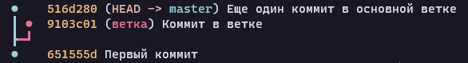

# RPGcord

## Настройка окружения

Чтобы работать над RPGcord вам понадобится:

- [Git](https://git-scm.com/downloads)
- [Python](https://www.python.org/downloads)
- [Node.js](https://nodejs.org/en/download/current)
- [GitHub CLI](https://cli.github.com/)

После установки всего этого, откройте терминал в соответствии с вашей ОС:

- `bash`/`fish`/и т.д.. если вы используете Linux или MacOS
- PowerShell 5+ если вы используете Windows 10+

Все последующие команды, если не указано иное, должны запускатся именно внутри него.

Первым делом выполните команду `gh auth login` и выберите следующие опции:

- "Github.com" (энтер)
- "HTTPS" (энтер)
- "Y" (энтер)
- "Login with a web browser"

После этого вам покажут код в форме `XXXX-XXXX`. Скопируйте его и нажмите энтер. Должно
открыться окно браузера, где вам предложат ввести ранее скопированный код. Вставьте его
и авторизуйте `gh` доступ к вашему аккаунту. Токен доступа к аккаунта будет сохранен
на вашем жестком диске и никогда не будет передан никому, кроме самого GitHub (для
аунтефикации).

Далее [установите `pipx`](https://pypa.github.io/pipx/installation/) и после запустите следующие
команды чтобы установить пакетный менеджер, склонировать (загрузить) этот репозиторий, и
настроить окружение (установить зависимости и т.п.):

```sh
pipx install pdm
git clone https://github.com/elenakrittik/rpgcord.git
cd rpgcord
pdm run setup_env
```

Чтобы запустить бота, вам понадобится настроенный и запущенный MySQL на вашем устройстве.
[Установите MariaDB](https://mariadb.org/download/?t=mariadb&p=mariadb&r=11.0.3),
улучшенную версию MySQL, выберите имя аккаунта администратора (root account) как 'root'
и установите для него пароль если пожелаете. Далее, в вышеуказанной консоли/терминале
запустите `mysql -u root -p` (уберите `-p` если вы не настраивали пароль для рут-аккаунта),
и выполните следующие команды чтобы настроить доступ к базе данных для RPGcord:

```sql
CREATE USER 'rpgcord'@'localhost' IDENTIFIED BY 'mypassword';
CREATE DATABASE rpgcord;
GRANT ALL ON rpgcord.* TO 'rpgcord'@'locahost';
```

После того, как вы выполнили вышеуказанные команды, вам надо выйти из `mysql` с помощью Ctrl+C,
скопировать `rpgcord/config.example.py` в `rpgcord/config.py`, открыть его и указать в строке
с `token = ""` внутри кавычек токен аккаунта вашего бота. После этого у вас должно получиться
запустить бота, выполнив в терминале команду `pdm run rpgcord`.

# Возможные ошибки

Если при выполнении команды `mysql -u root -p` вы получили такую ошибку:

```
ERROR 2002 (HY000): Can't connect to server on 'localhost' (10061)
```

Это значит, что сервер MySQL не запущен. Мы рекомендуем настроить MySQL
запускаться/выключаться когда ваша система включается/выключается. Чтобы сделать это, выберите
инструкции для вашей ОС [здесь](https://dev.mysql.com/doc/refman/8.0/en/automatic-start.html),
после чего перезапустите систему и продолжите с момента, когда вы попытались выполнить команду
`mysql -u root -p`.

Если при выполнение команды `CREATE USER ...` вы получили такую ошибку:

```
ERROR 1133 (28000): Can't find any matching row in the user table
```

То во всех командах замените `'localhost'` на `'127.0.0.1'` и попробуйте еще раз.

## Работа в Visual Studio Code

VS Code - рекомендованный редактор кода для работы над этим проектом.
Когда вы впервые откроете эту папку, VS Code предложит вам установить пару
расширений. **НЕ ИГНОРИРУЙТЕ ЭТО ПРЕДЛОЖЕНИЕ**. Установка всех расширений
намного улучшит ваш опыт работы с проектом (например, переместит все ошибки
линтера и тайп-чекера из консоли прямо в файл, который вы редактируете).

## Описание утилит

### YAPF

YAPF - утилита для форматирования кода. Форматирование здесь означает корректировку стиля
написанного кода. Благодаря единому стилю, за который отвечает не человек, а программа,
можно больше не просить коллегу по десять раз на день убрать "ту самую лишнюю строку".

### Pyright

Pyright - тайп-чекер для кода Python. Он отвечает за то, чтобы код, будт то свой или библиотеки,
использовался по назначению и именно так, как задумывал это его автор. Так как Python -
динамический язык программирования, единственный способ проверить, действительно ли некая
переменная, например, имеет тип `int` (т.е. является числом) - это функции `isinstance()` и
`type()`. Однако использование их в большом кол-ве приводит к ухудшению производительности кода.
Для решения этой проблемы в Python существует особый синтаксис называемый "тип-подсказка" (также
иногда называемый "аннотацией типа"), например:

```py
x: int = 1
#  ^^^ тип-подсказка
```

Сам Python полностью игнорирует эти подсказки, однако есть утилиты вроде Pyright, которые эти
подсказки "читают" и через процесс сложного анализа выдают результат: имеет ли такое-то выражение
правильный (по ситуации) тип. К примеру, если бы мы попробовали присвоить переменной `x` (см. выше)
значение `"Привет :3"` (строку) и после запустили бы на этом коде Pyright, он бы выдал ошибку,
говорящую о том, что в переменной `x` должно быть число, а программист пытается присвоить ей
строку (в данном примере название файла с кодом - `code.py`):

```
code.py
  code.py:1:10 - error: Expression of type "Literal['Привет :3']" cannot be assigned to declared type "int"
    "Literal['Привет :3']" is incompatible with "int" (reportGeneralTypeIssues)
1 error, 0 warnings, 0 informations
```

Pyright поставляется вместе с официальным расширением "Python" в VS Code, поэтому, установив его,
все ошибки будут также отображаться в окне редактора.

### Ruff

Ruff - линтер для кода Python. В отличии от тайп-чекера, линтер проверяет не типизацию кода, и
вместо этого проверяет код на семантические и/или лексические ошибки, которые не зависят от
конкретных типов и применяются к таким структурам кода в целом. Например, если мы создадим пустой
файл, добавим в него пару пробелов и потом еще одну пустую строку, а после запустим на нем Ruff,
мы получим следующую ошибку:

```
tstst.py:1:1: W293 [*] Blank line contains whitespace
Found 1 error.
[*] 1 potentially fixable with the --fix option.
```

Как вы можете заметить, Ruff также умеет автоматически исправлять некоторые типы ошибок. В примере
выше, если бы мы запустили Ruff с флагом `--fix`, он бы исправил ту ошибку и убрал пробелы.

### Команды

`pdm run format` - форматирует код.

`pdm run lint` - запускает линтер.

`pdm run type-check` - запускает тайп-чекер.

`pdm run pre-commit` - запускает все три вышеописанные команды + пару других проверок.

`pdm run docs` - запускает сервер документации с перезагрузкой на изменении файлов.

`pdm run rpgcord` - запускает бота.

## Работа с Git, GitHub и `gh`

Для начала в кратце опишем что означает каждое из этих понятий.

Git - "система контроля версий", а по сути - крутой инструмент для бэкапа кода и
распределения работы над одним проектом между несколькими людьми. Основные термины
при работе с Git: "репозиторий" (папка, по сути), "ветка" (описывается ниже) и
"коммит" (определенный момент в истории изменения кода, ветки. Можно описать как
"снапшот изменений", произошедших с момента последнего коммита).

GitHub - Хостинг для репозиториев Git, также включающий в себя фичи для более
высокоуровнего управления проектом, такие как "Проблемы" ("Issues", баг репорты,
запланированные улучшения и т.п.), "Запросы на слияние" ("Pull Requests", обычно
каждому ЗнС/PR соответсвует одна ветка и одна Проблема, и, соответственно, код в
ветке этого PR эту Проблему исправляет) и другие.

`gh` - консольная утилита, которая значительно упрощает работу с репозиториями,
хранящимися на GitHub. С помощью нее можно быстро переключаться между разными PR,
быстро создавать PR из локальной ветки. Есть и другие "ништяки" вроде полноценного
взаимодействия со всеми фичами GitHub, однако все, что они предлагают, уже доступно
в более дружелюбном к новичкам Web-интерфейсе (т.е. на сайте GitHub).

### Туториал: Создание нового PR, который добавляет новую функцию.

Для начала чуток теории.

Каждый репозиторий можно представить в виде дерева. Ствол дерева - это, по сути, его
основная ветка. В Git по историческим причинам основную ветку принято называть `master`.
Из ствола дерева переодически вырастают ответвления, боковые ветки. Каждая ветка обычно
отвечает за один багфикс или одну новую фичу. На каждой ветке растут листы - коммиты.
Коммиты содержат в себе информацию об изменениях, произошедших с репозиторием с момента
создания последнего коммита в истории ветки.



> На картинке сверху мы можем видеть, что дерево нашего репозитория растет из первого коммита.
> После него из основной ветки `master` была создана новая ветка `ветка`. В ней был создан
> новый коммит "Коммит в ветке". После этого в основную ветку, никак не затрагивая `ветку`,
> был добавлен еще один коммит.

Каждому PR на GitHub соответствует одна ветка Git. По умолчанию, когда вы только начинаете
работать в репозитории, вы находитесь на основной ветке (`master`). Чтобы переключаться
между ветками, создавать и удалять их, используются следующие команды (используйте как
шпаргалку пока не запомните ~0 - 0~ ):

- `git switch -c <название новой ветки>` - создать новую ветку из текущей и переключится на нее.
- `git branch -d <название ветки>` - удалить ветку.
- `git switch <название ветки>` - переключиться на другую ветку.

Например, чтобы вернуться на основную ветку, мы бы прописали `git switch master`.

Так как мы хотим добавить новую функцию и после отправить ее в виде PR, создадим новую ветку:

```sh
git switch -c add-function
```

> Заметка: названия веток лучше не писать на кириллице, так как с ней могут быть проблемы.

После этого создадим новый файл `rpgcord/utils.py` и добавим в него простенькую функцию.

```py
def add(first: int, second: int):
    return first + second

```

> Важно: не удаляйте пустую строку в конце файла.

Теперь мы хотим создать коммит, который будет содержать информацию о том, что мы создали файл
`rpgcord/utils.py` с кодом, приведенным выше. Git не распознает изменения в файлах автоматически,
поэтому над надо использовать команду `git add <файл(-ы)/папка(-и)>` чтобы Git изменения стали
видимы для Git:

```sh
git add .
```

> В примере выше мы используем `.` в качестве файла/папки. В большинстве консолей `.` часто
> обозначает "текущая папка", соответственно, команда `git add .` означает "зарегистрировать
> изменения, произошедшие во всех файлах в текущей папке", т.е. мы по сути регистрируем все
> изменения в нашем проекте, будь то код или документация.
>
> Также, большинство терминалов на Unix-системах автоматически превращают символ `*` в полный
> список файлов перед выполнением команды, т.е. если вы находитесь в папке с файлами `hello.txt`
> и `bye.txt`, `git add *` перед выполнением превратится в `git add hello.txt bye.txt`. В `cmd`,
> а также ранних версиях PowerShell, такой фичи не было, а посколько Git старается быть
> кроссплатформенным, он адаптировал `.` как замену `*`.

После того как мы указали Git-у на изменения и он о них знает, мы может сделать коммит, который
сохранит эти изменения и позволит позже откатить их, в случае если с кодом найдена критическая
ошибка. Для создания коммита используется команда `git commit -m "<описание сделанных изменений>"`:

```sh
git commit -m "feat: Добавить add()"
```

> Заметьте, что в сообщениях коммита *можно* использовать кириллицу.

> Описания ("сообщения", как они правильно называются) коммитов обычно подчиняются некоторым
> правилам. Во-первых, они должны следовать конвенции ["Conventional Commits"](https://www.conventionalcommits.org/ru/).
> Во-вторых, они используют инфинитивную форму глаголов для описания изменений (не "Сделал",
> а "Сделать"). Во время простой разработки следовать этим правилам не обязательно, однако
> все коммиты на главной ветке обязательно соблюдают вышеперечисленные схемы.

> Если вы хотите сохранить время и не печатать `git add .` каждый раз вы хотите сделать коммит,
> вы можете использовать вот такую форму команды коммита: `git commit -am <описание>`. Флаг `-a`
> говорит Git-у перед созданием коммита зарегистрировать все изменения в *уже зарегистрированных
> файлах*, т.е. **если вы создадите новый файл, вам все равно будет надо использовать `git add`
> чтобы его добавить!** Тем не менее, данный флаг часто бывает полезным.

Если у вас правильно [настроено окружение](#настройка-окружения), то перед созданием коммита Git
(а точнее [pre-commit](https://pre-commit.com)) будет запускать различные проверки на изменениях,
которые вы сделали. В основном они включают в себя проверки поддержки кроссплатформенности (мы
ведь хотим, чтобы бота разрабатывать можно было на любой ОС, правильно?) и утилиты для проверки
качества и правильности кода: YAPF, Pyright и Ruff (также см. [команды](#команды)
чтобы запускать их вручную).

В нашем случае при создании коммита должна появиться такая ошибка:

```
check for case conflicts................................................. Passed
check toml............................................................... Passed
check yaml...........................................(no files to check) Skipped
fix end of files......................................................... Passed
trim trailing whitespace................................................. Passed
no symlinks..........................................(no files to check) Skipped
yapf..................................................................... Passed
ruff..................................................................... Failed
- hook id: ruff
- exit code: 1

rpgcord\utils.py:1:5: ANN201 Missing return type annotation for public function `add`
Found 1 error.

pyright.................................................................. Passed
```

Исправим её, добавив аннотацию типа для нашей функции:

```python
def add(first: int, second: int) -> int:
    return first + second

```

Теперь, используя `git commit -am "feat: Добавить add()"` мы сможем создать наш коммит:

```
check for case conflicts................................................. Passed
check toml............................................................... Passed
check yaml...........................................(no files to check) Skipped
fix end of files......................................................... Passed
trim trailing whitespace................................................. Passed
no symlinks..........................................(no files to check) Skipped
yapf..................................................................... Passed
ruff..................................................................... Passed
pyright.................................................................. Passed
[add-function ba60053] feat: Добавить add()
 1 file changed, 3 insertions(+), 0 deletions(-)
 create mode 100644 rpgcord/utils.py
```

Супер! У нас есть ветка, и у нас есть коммит с нашими изменениями. Теперь можно наконец создать
PR. Для этого, используем команду `gh pr create`.

На вопросы отвечайте следующим образом:

- `elenakrittik/rpgcord`
- Введите название вашего PR.
- `PULL_REQUEST_TEMPLATE.md`
- Нажмите английскую "E", отредактируйте файл, сохраните и выйдите из редактора обратно в VS Code.
- `Submit`

Готово! У вас в терминале должна появиться ссылка на ваш новенький PR.

> Подсказка: чтобы вернуться на основную ветку после того, как вы закончили, используйте
> `git switch master`.

> Подсказка: если вы позже добавите больше коммитов, для отправки их на GitHub используйте
> `git push`.
>
> Подсказка: если на GitHub появлились новые ветки/коммиты от других разработчиков, или
> основная ветка была обновлена, для загрузки работы к себе используйте `git pull`.
>
> Важно: перед использованием двух вышеописанных команд вам необходимо включить одну опцию
> в Git с помощью `git config --global --add --bool push.autoSetupRemote true`. Иначе, вам
> придется каждый раз дополнительно указывать ветку, куда/откуда вы хотите отправить/получить
> изменения.

> Рекомендуем [данный](https://training.github.com/downloads/ru/github-git-cheat-sheet/) материал
> как хорошую памятку по основам Git-а.

> Git также имеет полноценную документацию на русском: https://git-scm.com/book/ru/v2/
